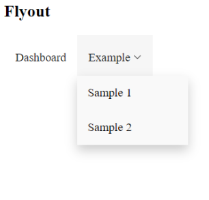

# @scripty/react-navigations

# Description

lightweight react navigation components.



# Usage
```bash
npm install -s @scripty/react-navigations
```

##### Client: Example.jsx

```javascript
import React, { Fragment } from 'react';
import { BrowserRouter as Router } from 'react-router-dom';
import { Flyout } from '@src';

export const Example = () => {

    const onClick = (key) => {
        console.log(key);
    }

    const routes = [
        {
            "key" : "Dashboard",
            "component" : "Dashboard",
            "label" : "Dashboard",
            "icon" : "dashboard",
            "path" : "/",
            "access" : "Visitor",
            "exact" : true
        },
        {
            "key" : "Example",
            "component" : "#",
            "label" : "Example",
            "icon" : "experiment",
            "path" : "/example",
            "access" : "Admin",
            "submenu" : [
                {
                    "key" : "Example1",
                    "component" : "Example1",
                    "label" : "Sample 1",
                    "path" : "/sample1",
                    "access" : "Admin"
                },
                {
                    "key" : "Example2",
                    "component" : "Example2",
                    "label" : "Sample 2",
                    "path" : "/sample2",
                    "access" : "Admin"
                }
            ]
        }
    ]

    return (
        <Router>
            <h2>Flyout</h2>
            <Flyout onClick={onClick} routes={routes} />
        </Router>
    );
};
```
