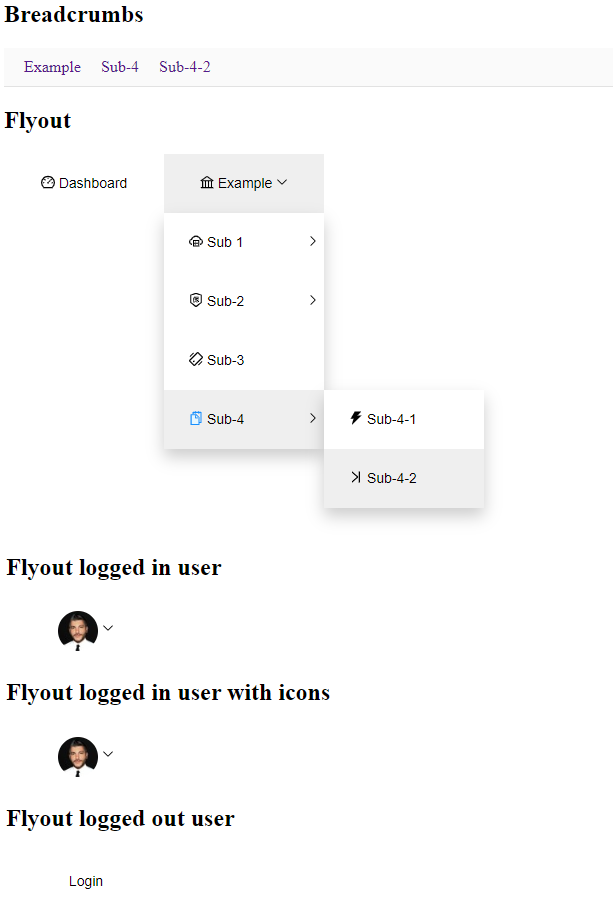

# @scripty/react-navigations

# Description

lightweight react navigation components.



# Usage
```bash
npm install -s @scripty/react-navigations
```

The navigation components are powered by Antd-Design-Icons:
https://ant.design/components/icon/

Just add the name of the desired icon as a string property (see example).

#####if you want a leightweighter version, use "Flyout"-Component instead of "FlyoutWithIcons"-Component.

##### Client: Example.jsx

```javascript
import React, { useState } from 'react';
import { BrowserRouter as Router } from 'react-router-dom';
import { FlyoutWithIcons } from '@scripty/react-navigations/FlyoutWithIcons';
import { Breadcrumbs } from '@scripty/react-navigations/Breadcrumbs';

export const Example = () => {

    const [ selectedKeys, setSelectedKeys ] = useState([])

    const onClick = (key, selectedKeys) => {
        setSelectedKeys(selectedKeys);
    }

    const routes = [
        {
            "key" : "Dashboard",
            "label" : "Dashboard",
            "icon" : "DashboardOutlined",
            "path" : "/",
            "exact" : true
        },
        {
            "key" : "Example",
            "label" : "Example",
            "icon" : "BankOutlined",
            "path" : "/example",
            "submenu" : [
                {
                    "key" : "Sub-1",
                    "label" : "Sub 1",
                    "path" : "/sub1",
                    "icon" : "CloudServerOutlined",
                    "submenu" : [
                        {
                            "key" : "Sub-1-1",
                            "label" : "Sub-1-1",
                            "path" : "/sub-1-1",
                            "icon" : "CreditCardFilled",
                        }
                    ]
                },
                {
                    "key" : "Sub-2",
                    "label" : "Sub-2",
                    "path" : "/sub-2",
                    "icon" : "InsuranceOutlined",
                    "submenu" : [
                        {
                            "key" : "Sub-2-1",
                            "label" : "Sub-2-1",
                            "path" : "/sub-2-1",
                            "icon" : "ProfileTwoTone",
                        }
                    ]
                },
                {
                    "key" : "Sub-3",
                    "label" : "Sub-3",
                    "path" : "/sub-3",
                    "icon" : "ShakeOutlined",
                },
                {
                    "key" : "Sub-4",
                    "label" : "Sub-4",
                    "path" : "/sub-4",
                    "icon" : "SnippetsTwoTone",
                    "submenu" : [
                        {
                            "key" : "Sub-4-1",
                            "label" : "Sub-4-1",
                            "path" : "/sub-4-1",
                            "icon" : "ThunderboltFilled",
                        },
                        {
                            "key" : "Sub-4-2",
                            "label" : "Sub-4-2",
                            "path" : "/sub-4-2",
                            "icon" : "VerticalLeftOutlined",
                        }
                    ]
                }
            ]
        }
    ]

    return (
        <Router>
            <h2>Breadcrumbs</h2>
            <Breadcrumbs onClick={onClick} routes={routes} selectedKeys={selectedKeys} />
            <h2>Flyout</h2>
            <FlyoutWithIcons onClick={onClick} routes={routes} selectedKeys={selectedKeys} />
        </Router>
    );
};
```
# Components

Name              | Description                                         |
----------------- |---------------------------------------------------- |
Flyout            |  3 Level Flyout Navigation                          |
FlyoutWithIcons   |  3 Level Flyout Navigation with Antd-Icons library  |
Breadcrumbs       |  Breadcrumbs based on given routes                  |

# Navigation Properties

Property           | Type     |  Default  |
------------------ |--------- |-----------
onClick            | Function |
routes             | Array    |
selectedKeys       | Array    |

# Route Properties

Property           | Type     |  Description             |
------------------ |--------- |--------------------------|
key                | String   | unique id key (required) |
label              | String   | (required)               |
path               | String   | (required)               |
icon               | String   | (optional)               |

# Breadcrumbs Properties

Property           | Type     |  Default  |
------------------ |--------- |-----------
onClick            | Function |
routes             | Array    |
selectedKeys       | Array    |
